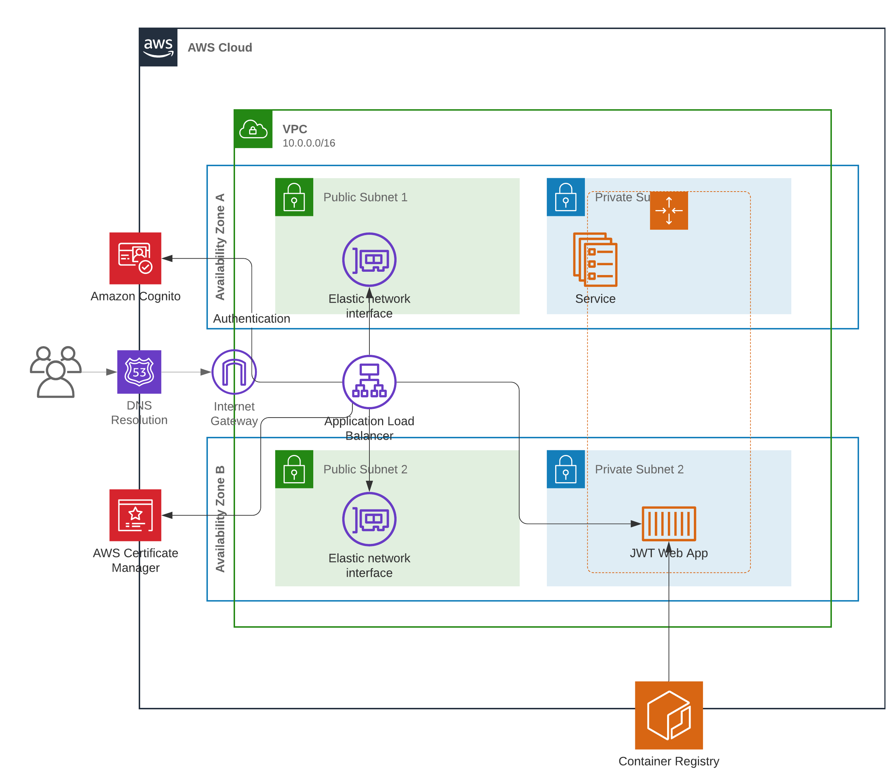

# Q&Aid


# AWS backend deployment

## Introduction

The code is used deployment the Q&Aid backend in AWS.

The code is inspired from https://aws-blog.de/2020/03/building-a-fargate-based-container-app-with-cognito-authentication.html

This CDK app sets up infrastructure that can be used for the integration with the Application Load Balancer. Furthermore it includes not only the log in but also the log out workflow.

## Architecture



This stack builds up a bunch of things:

- A DNS-Record for the application.
- A SSL/TLS certificate.
- An Application Load Balancer with that DNS recorcd and certificate.
- An ECR Container Registry to push our Docker image to.
- An ECS Fargate Service to run our Q&Aid backend.

## Prerequisites

- CDK is installed.
- Docker is installed.
- You have a public hosted zone in your account(You can use Route53 for that).

## Steps to deploy

1. Review the variables in `backend/stack.py` and edit these variables as described in the [blog article](https://aws-blog.de/2020/03/building-a-fargate-based-container-app-with-cognito-authentication.html):

    ```python
    APP_DNS_NAME = "q-and-aid.com"
    HOSTED_ZONE_ID = "Z09644041TWEBPC10I0YZ"
    HOSTED_ZONE_NAME = "q-and-aid.com"
    ```
2. Make sure you have a valid AWS profile. You can generate one using
```amplify configure```
3. `cdk --profile medqaid-profile bootstrap aws://unknown-account/eu-central-1`
4. Run `cdk synth` to check if the CDK works as expected, you can inspect the template if you're curious.
5. Run `cdk deploy` to deploy the resources.
